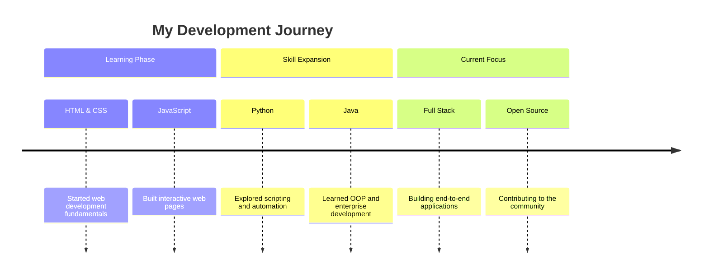

<div align="center">

<!-- ============== ANIMATED HEADER BANNER ============== -->


<!-- ============== TYPING SVG ============== -->

<a href="https://git.io/typing-svg">
  
</a>

<!-- ============== PROFILE VIEWS & SOCIAL BADGES ============== -->

<br/>


&nbsp;
<a href="https://github.com/litongle?tab=followers">
  
</a>
&nbsp;
<a href="https://github.com/litongle?tab=repositories&sort=stargazers">
  
</a>

</div>

---

<!-- ============== ABOUT ME SECTION ============== -->

##  &nbsp;About Me


<br/>

- **Passionate Developer** dedicated to building elegant and efficient solutions
- Currently deepening expertise in **HTML / Java / Python**
- Exploring **Full Stack Development** and **Cloud Architecture**
- Firm believer in **clean code**, **continuous learning**, and **open collaboration**
- Always open to interesting projects and collaboration opportunities

<br/>

> *"The only way to do great work is to love what you do."* — Steve Jobs

<br clear="both"/>

---

<!-- ============== TECH STACK SECTION ============== -->

##  &nbsp;Tech Stack & Skills

<div align="center">

### Languages
<br/>


### Frameworks & Libraries
<br/>


### Tools & Platforms
<br/>


</div>

<br/>

<!-- ============== SKILL RADAR CHART ============== -->

<div align="center">

### Skill Proficiency

```
  Frontend  ████████████████░░░░  80%
  Backend   ██████████████░░░░░░  70%
  Python    ████████████████░░░░  80%
  Java      ██████████████░░░░░░  70%
  DevOps    ██████████░░░░░░░░░░  50%
  Database  ████████████░░░░░░░░  60%
```

</div>

---

<!-- ============== GITHUB STATS SECTION ============== -->

##  &nbsp;GitHub Analytics

<div align="center">

<a href="https://github.com/litongle">
  
  
</a>

<br/><br/>

<!-- Streak Stats -->
<a href="https://github.com/litongle">
  
</a>

<br/><br/>

<!-- Activity Graph -->
<a href="https://github.com/litongle">
  
</a>

</div>

---

<!-- ============== PROJECTS SECTION ============== -->

##  &nbsp;Featured Projects

<div align="center">

<a href="https://github.com/litongle/litongle">
  
</a>

</div>

<br/>

<div align="center">

| Project | Description | Tech Stack |
|:-------:|:-----------:|:----------:|
| **Profile Page** | This GitHub profile README | `Markdown` `HTML` `SVG` |
| *More coming soon...* | *Stay tuned for exciting projects!* | - |

</div>

---

<!-- ============== EXPERIENCE & EDUCATION SECTION ============== -->

##  &nbsp;Journey & Growth

<div align="center">



</div>

<br/>

<table align="center">
<tr>
<td width="50%" valign="top">

### Current Focus
- Web Application Development
- Backend Systems with Java & Python
- Database Design & Optimization
- RESTful API Development

</td>
<td width="50%" valign="top">

### Learning Roadmap
- Cloud Services (AWS / Azure)
- Containerization & CI/CD
- Microservices Architecture
- Machine Learning Basics

</td>
</tr>
</table>

---

<!-- ============== CONTRIBUTION SNAKE ============== -->

##  &nbsp;Contribution Graph

<div align="center">

<picture>
  <source media="(prefers-color-scheme: dark)" srcset="https://raw.githubusercontent.com/platane/snk/output/github-contribution-grid-snake-dark.svg" />
  <source media="(prefers-color-scheme: light)" srcset="https://raw.githubusercontent.com/platane/snk/output/github-contribution-grid-snake.svg" />
  
</picture>

</div>

---

<!-- ============== TROPHY SECTION ============== -->

<div align="center">

<a href="https://github.com/litongle">
  
</a>

</div>

---

<!-- ============== CONNECT SECTION ============== -->

##  &nbsp;Let's Connect

<div align="center">

<a href="https://github.com/litongle" target="_blank">
  
</a>
&nbsp;

&nbsp;


<br/><br/>

**Collaboration is always welcome! Feel free to reach out.**

</div>

---

<!-- ============== RANDOM DEV QUOTE ============== -->

<div align="center">


</div>

---

<!-- ============== FOOTER ============== -->

<div align="center">


<br/>


&nbsp;


<br/><br/>

*If you find my work interesting, consider giving a star!*

</div>
