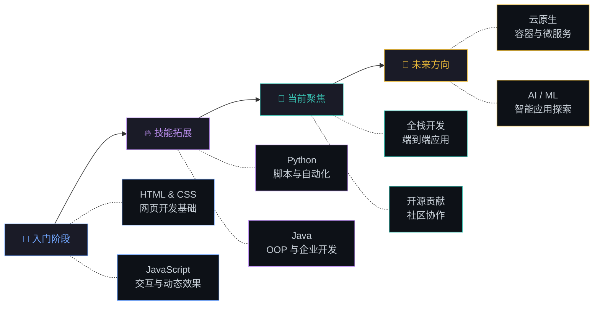

<!-- ============================================================ -->
<!--                    HEADER / HERO SECTION                     -->
<!-- ============================================================ -->

<div align="center">


<!-- 打字动画 -->
<a href="https://git.io/typing-svg">
  
</a>

<br/>

<!-- 计数器与社交徽章 -->

&ensp;
<a href="https://github.com/litongle?tab=followers">
  
</a>
&ensp;
<a href="https://github.com/litongle?tab=repositories&sort=stargazers">
  
</a>

</div>

<br/>

<!-- ============================================================ -->
<!--                       关于我                                  -->
<!-- ============================================================ -->

## &ensp;关于我

<table>
<tr>
<td width="55%" valign="top">

```yaml
name: Litongle
located_in: 中国
role: 全栈开发者
currently_learning:
  - HTML / CSS / JavaScript
  - Java & Spring Boot
  - Python & Flask
interests:
  - Web 应用开发
  - 后端架构设计
  - 开源项目贡献
  - 云原生技术
hobbies:
  - 编程
  - 技术写作
  - 探索新技术
motto: "代码改变世界，热爱驱动成长"
```

</td>
<td width="45%" valign="top" align="center">


<br/>

> ***"优秀的代码是写给人看的，顺便能在机器上运行。"***

</td>
</tr>
</table>

<br/>

<!-- ============================================================ -->
<!--                       技术栈                                  -->
<!-- ============================================================ -->

## &ensp;技术栈

<div align="center">

<table>
<tr>
<td align="center" width="33%">

**编程语言**

<br/>

[](https://skillicons.dev)

</td>
<td align="center" width="33%">

**框架与库**

<br/>

[](https://skillicons.dev)

</td>
<td align="center" width="33%">

**工具与平台**

<br/>

[](https://skillicons.dev)

</td>
</tr>
</table>

<br/>

<!-- 技能熟练度 -->
<details>
<summary><b>📊 技能熟练度</b></summary>
<br/>

| 技能领域 | 熟练度 | 等级 |
|:--------:|:------:|:----:|
| **前端开发** | `████████████████████░░░░░` | 80% |
| **后端开发** | `██████████████████░░░░░░░` | 72% |
| **Python** | `████████████████████░░░░░` | 80% |
| **Java** | `██████████████████░░░░░░░` | 72% |
| **数据库** | `███████████████░░░░░░░░░░` | 60% |
| **DevOps** | `████████████░░░░░░░░░░░░░` | 48% |

</details>

</div>

<br/>

<!-- ============================================================ -->
<!--                     GitHub 数据面板                            -->
<!-- ============================================================ -->

## &ensp;GitHub 数据面板

<div align="center">

<!-- 统计卡片 - 深色/浅色自适应 -->
<picture>
  <source media="(prefers-color-scheme: dark)" srcset="https://github-readme-stats.vercel.app/api?username=litongle&show_icons=true&hide_border=true&bg_color=00000000&title_color=70a5fd&icon_color=bf91f3&text_color=38bdae&ring_color=70a5fd&count_private=true&include_all_commits=true&locale=cn" />
  <source media="(prefers-color-scheme: light)" srcset="https://github-readme-stats.vercel.app/api?username=litongle&show_icons=true&hide_border=true&bg_color=00000000&title_color=0969da&icon_color=8250df&text_color=1f6feb&ring_color=0969da&count_private=true&include_all_commits=true&locale=cn" />
  
</picture>
&ensp;
<picture>
  <source media="(prefers-color-scheme: dark)" srcset="https://github-readme-stats.vercel.app/api/top-langs/?username=litongle&layout=compact&hide_border=true&bg_color=00000000&title_color=70a5fd&text_color=38bdae&langs_count=8&locale=cn" />
  <source media="(prefers-color-scheme: light)" srcset="https://github-readme-stats.vercel.app/api/top-langs/?username=litongle&layout=compact&hide_border=true&bg_color=00000000&title_color=0969da&text_color=1f6feb&langs_count=8&locale=cn" />
  
</picture>

<br/><br/>

<!-- 连续贡献 -->
<picture>
  <source media="(prefers-color-scheme: dark)" srcset="https://github-readme-streak-stats.herokuapp.com/?user=litongle&hide_border=true&background=00000000&stroke=30363d&ring=70a5fd&fire=bf91f3&currStreakLabel=70a5fd&sideLabels=38bdae&currStreakNum=38bdae&sideNums=38bdae&dates=8b949e&locale=zh_Hans" />
  <source media="(prefers-color-scheme: light)" srcset="https://github-readme-streak-stats.herokuapp.com/?user=litongle&hide_border=true&background=00000000&stroke=d0d7de&ring=0969da&fire=8250df&currStreakLabel=0969da&sideLabels=1f6feb&currStreakNum=1f6feb&sideNums=1f6feb&dates=656d76&locale=zh_Hans" />
  
</picture>

<br/><br/>

<!-- 活动图 -->
<picture>
  <source media="(prefers-color-scheme: dark)" srcset="https://github-readme-activity-graph.vercel.app/graph?username=litongle&bg_color=00000000&color=70a5fd&line=bf91f3&point=38bdae&area=true&area_color=70a5fd&hide_border=true&custom_title=%E8%BF%91%E6%9C%9F%E8%B4%A1%E7%8C%AE%E6%B4%BB%E5%8A%A8" />
  <source media="(prefers-color-scheme: light)" srcset="https://github-readme-activity-graph.vercel.app/graph?username=litongle&bg_color=00000000&color=0969da&line=8250df&point=1f6feb&area=true&area_color=0969da&hide_border=true&custom_title=%E8%BF%91%E6%9C%9F%E8%B4%A1%E7%8C%AE%E6%B4%BB%E5%8A%A8" />
  
</picture>

</div>

<br/>

<!-- ============================================================ -->
<!--                       成长之路                                -->
<!-- ============================================================ -->

## &ensp;成长之路

<div align="center">



</div>

<br/>

<table align="center">
<tr>
<td width="50%" valign="top">

### 🎯 当前聚焦

<ul>
  <li>Web 全栈应用开发</li>
  <li>Java & Python 后端系统</li>
  <li>数据库设计与性能优化</li>
  <li>RESTful API 架构设计</li>
</ul>

</td>
<td width="50%" valign="top">

### 🗺️ 学习路线

<ul>
  <li>云服务（阿里云 / AWS）</li>
  <li>容器化与 CI/CD 流水线</li>
  <li>微服务架构实践</li>
  <li>机器学习与 AI 入门</li>
</ul>

</td>
</tr>
</table>

<br/>

<!-- ============================================================ -->
<!--                    贡献动画 (贪吃蛇)                          -->
<!-- ============================================================ -->

## &ensp;贡献图动画

<div align="center">

<picture>
  <source media="(prefers-color-scheme: dark)" srcset="https://raw.githubusercontent.com/platane/snk/output/github-contribution-grid-snake-dark.svg" />
  <source media="(prefers-color-scheme: light)" srcset="https://raw.githubusercontent.com/platane/snk/output/github-contribution-grid-snake.svg" />
  
</picture>

</div>

<br/>

<!-- ============================================================ -->
<!--                       荣誉奖杯                                -->
<!-- ============================================================ -->

<div align="center">

<picture>
  <source media="(prefers-color-scheme: dark)" srcset="https://github-profile-trophy.vercel.app/?username=litongle&theme=darkhub&no-frame=true&no-bg=true&margin-w=10&column=7" />
  <source media="(prefers-color-scheme: light)" srcset="https://github-profile-trophy.vercel.app/?username=litongle&theme=flat&no-frame=true&no-bg=true&margin-w=10&column=7" />
  
</picture>

</div>

<br/>

<!-- ============================================================ -->
<!--                       联系方式                                -->
<!-- ============================================================ -->

## &ensp;联系方式

<div align="center">

<a href="https://github.com/litongle" target="_blank">
  
</a>
&ensp;

&ensp;


<br/><br/>

**欢迎交流合作！有任何想法或项目，随时联系我。**

</div>

<br/>

<!-- ============================================================ -->
<!--                       每日一言                                -->
<!-- ============================================================ -->

<div align="center">


</div>

<br/>

<!-- ============================================================ -->
<!--                         页脚                                  -->
<!-- ============================================================ -->


<div align="center">


&ensp;


*如果你觉得不错，欢迎点个 ⭐ 支持一下！*

</div>
